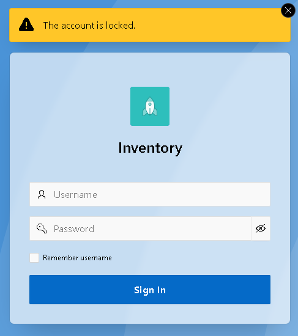
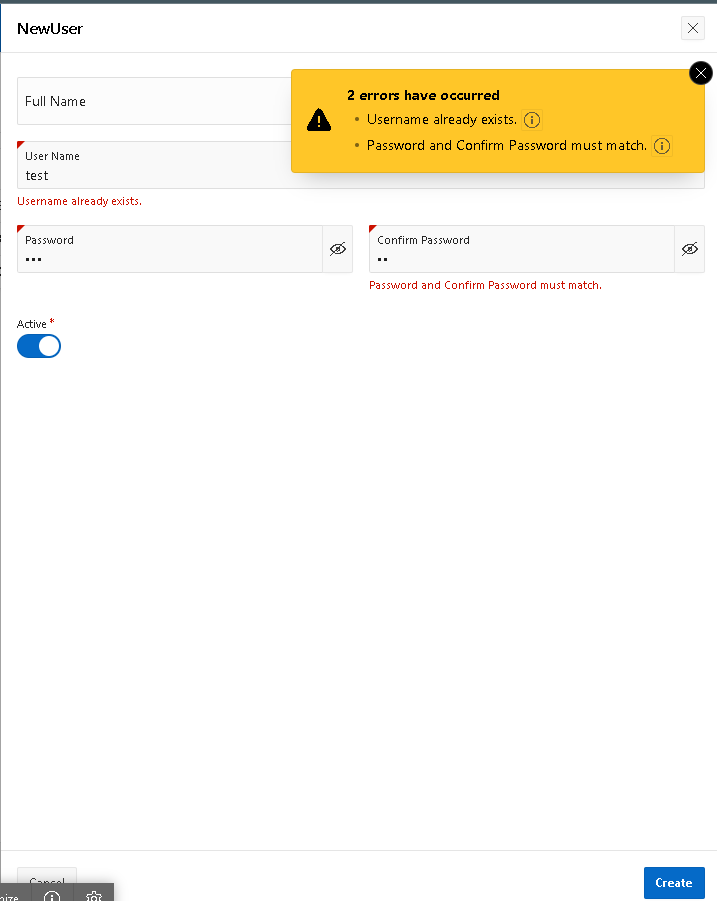

# 🔐 Building a Custom Authentication Scheme in Oracle APEX with Salted SHA‑256

Authentication is the backbone of any secure application. While Oracle APEX provides built‑in schemes, sometimes you need full control over how users are validated.  
This project demonstrates how to create a **custom authentication scheme** in Oracle APEX using **salted SHA‑256 hashing** for secure password storage and validation.

---

## 🛠 Features
- Custom authentication scheme integrated into Oracle APEX.
- Secure password storage using **salt + SHA‑256 hash**.
- PL/SQL functions for hashing and user validation.
- Login page connected to the custom scheme.
- Password change drawer page with validations.

---

## 📂 Repository Contents
- `sql/users.sql` → Table definition for users and hashing functions.  
- `sql/auth_functions.sql` → Authentication and password management functions.  
- `apex/CustomAuthApp.sql` → Exported APEX application.  
- `screenshots/` → Login page, authentication flow, and password change drawer (with timestamps).  
- `README.md` → Documentation, setup instructions, and learning outcomes.  

---

## 🛠 Setup Instructions
1. Run `sql/users.sql` to create the `users` table.  
2. Run `sql/auth_functions.sql` to create hashing and authentication functions.  
3. Import `apex/CustomAuthApp.sql` into Oracle APEX.  
4. Go to **Shared Components → Authentication Schemes** and set the scheme to use `authenticate_user`.  
5. Add sample users with salted SHA‑256 passwords using the provided insert statements.  

---

## 📸 Screenshots
- Login page with custom authentication scheme.
 
- Password change drawer page.

*(Screenshots with timestamps are included in the `/screenshots` folder.)*

---

## 🎯 Learning Outcomes
- Learned how to build secure authentication flows in Oracle APEX.  
- Implemented salted SHA‑256 hashing for password protection.  
- Practiced integrating PL/SQL logic with APEX authentication schemes.  
- Extended functionality with password change flows and validations.  

---

## ✅ Contribution Value
This project demonstrates **real‑world security practices** in Oracle APEX, aligning with Oracle ACE Program goals by:  
- Sharing knowledge on custom authentication.  
- Providing reusable code and documentation.  
- Encouraging community learning with practical examples. 
